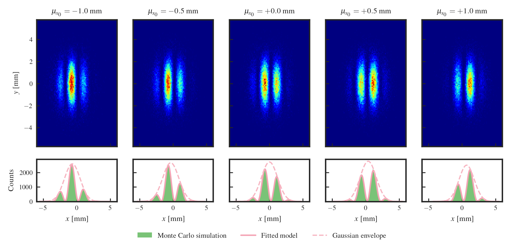
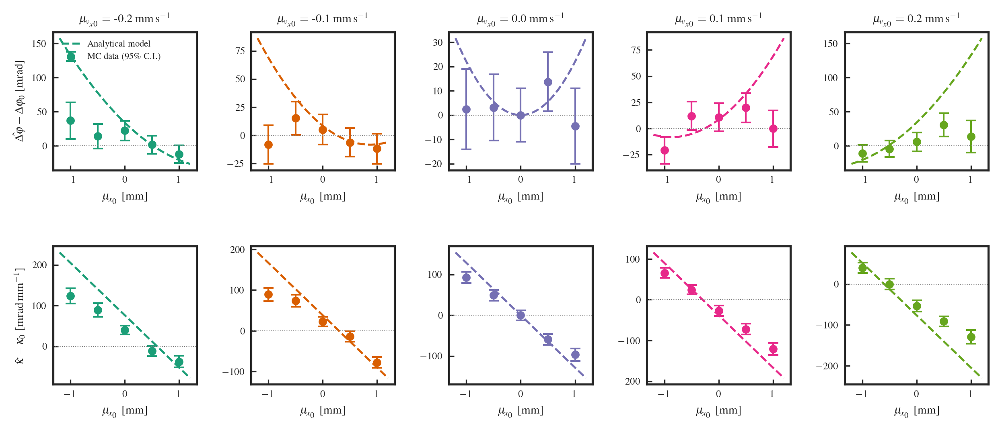

# AISPY v0.0.1

Python toolkit for building and analysing [ais++](https://github.com/noammouelle/aispp)
atom-interferometry simulations.

## Description

aispy provides two main components:

- **`aispy.utils.AISFlow`** — translates a Python parameter dictionary into a
  ready-to-run `.aisi` input file for ais++, handling the full Mach–Zehnder
  sequence with LMT beam splitters, Phase-Shear Readout, and Gaussian wavefronts.
- **`aispy.analysis`** — utilities for loading ais++ HDF5 output files and
  extracting fitted fringe parameters.

Version 0.0.1 supports multi-loop Mach–Zehnder sequences on the Sr-87 ultranarrow
clock transition. It is designed for use with ais++ v0.0.1.

---



*Phase-Shear Readout fringe patterns from an LMT-101 Mach–Zehnder interferometer
(N = 100 000 atoms, T = 2.225 s, κ_PSR = 3140 rad/m) for five initial cloud positions.
Top: 2D atom density at detection. Bottom: x-projection with fitted model (C ≈ 0.96).
Position-dependent κ encodes the wavefront-curvature phase shift.*



*Position-resolved fringe parameters for 25 simulations (5 × 5 grid of initial COM
positions and velocities). Circles: Monte Carlo data with 2σ error bars.
Dashed: analytical wavefront-curvature model from [Mouelle et al. (2025)](https://arxiv.org/abs/2510.26739).*

---

## Examples

The `examples/` folder contains a complete end-to-end demonstration of the aispy
workflow, reproducing Figs. 9 and 10 from [Mouelle et al. (2025)](https://arxiv.org/abs/2510.26739).

```bash
# 0. Install dependencies
pip install aispy numpy scipy matplotlib h5py pandas jupyter

# 1. (Optional) Generate ais++ input files for the 5×5 simulation grid
cd examples/
python build_inputs.py --natoms 100000 --nlmt 101

# 2. (Optional) Run all 25 simulations
#    Pre-generated outputs are included so this step can be skipped.
for f in input-files/PSR_WA_NLMT101_*.aisi; do
    stem=$(basename "$f" .aisi)
    ais++ -i "$f" -o "output-files/${stem}.h5"
done

# 3. Open the notebook and run all cells
jupyter notebook example_1.ipynb
```

## Installation

Clone this repository, then from the top-level directory run:

```bash
pip install .
```

## References

[1] Mouelle et al., *Wavefront Curvature and Transverse Atomic Motion in Time-Resolved
Atom Interferometry: Impact and Mitigation*, arXiv:2510.26739 (2025).
